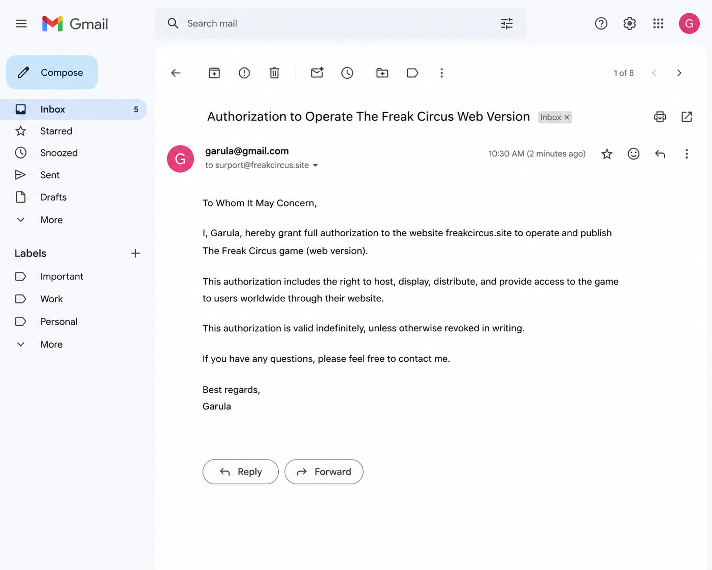

# 🎪 The Freak Circus

### *The Circus of Horrors has arrived. Don't be fooled by their smiles.*

---

> *"I wanted to draw desserts and café scenes. I wanted horror. I wanted clowns who love too much and hide it beneath a smile. That's how The Freak Circus was born."*
> — **Garula**, creator of The Freak Circus

---

## 🔐 Authorization Notice

This repository is maintained **with the express authorization of Garula**, the original creator and sole developer of *The Freak Circus*. Its sole purpose is to direct players to the official, unmodified version of the game and protect the creator's work from unauthorized distribution.

> 📌 The **only** official place to play The Freak Circus online is:
> ### 👉 [https://freakcircus.site](https://freakcircus.site)
>
> Third-party sites may host incomplete, outdated, or tampered versions. Always play from the official source to support Garula directly.

---

## 🎭 What Is The Freak Circus?

**The Freak Circus** is an 18+ psychological horror visual novel developed by solo indie creator **Garula**. Released on itch.io, it rapidly became one of the most talked-about horror games in the indie community — earning over **8,000 ratings** and a near-perfect score of **4.9/5**.

You play as a **café worker** whose quiet, ordinary life is shattered the moment you cross paths with **Pierrot** — a silent, dangerously obsessed yandere performer from the Circus of Horrors that has just rolled into town. Before you can make sense of it all, his seductive stage rival **Harlequin** decides to join the game, turning your fate into the prize of a twisted competition fueled by jealousy, manipulation, and desire.

Every choice matters. Every smile hides something darker. **Welcome to the show.**

---

## 🤡 Characters

### Pierrot — *The Silent Yandere*
He doesn't speak much. He doesn't need to. The bell around his neck, the tilt of his head, the gifts left without warning — Pierrot's obsession communicates itself in ways words never could. Silent, possessive, and terrifyingly devoted.

### 🃏 Harlequin — *The Seductive Rival*
Charismatic, unpredictable, and dangerous. Harlequin enters the story not for you — but to win against Pierrot. His charm is a weapon. His smile is a trap.

### 🎟️ Ticket Taker *(Day 2)*
The gatekeeper of the circus. Polite on the surface. Something else entirely underneath.

### 🃏 Jester *(Day 2)*
A new presence beneath the tents. Unsettling in ways that take time to place.

### 🩺 Doctor *(Day 2)*
You may remember the Doctor from the "Missing" bad end. Now, a proper introduction awaits — and it won't be comfortable.

---

## 🎮 How to Play

**No downloads. No installations. No account required.**

Open your browser, go to **[freakcircus.site](https://freakcircus.site)**, and the show begins.

| Platform | Supported |
| :--- | :---: |
| Windows (Chrome, Firefox, Edge) | ✅ |
| macOS (Safari, Chrome) | ✅ |
| iPad / Android Tablet | ✅ |
| iPhone / Android Phone | ✅ |
| Chromebook | ✅ |

> 💡 **Tip:** Wait 1–2 minutes for the game to fully load. The music begins after you enter your name — that's your cue the circus is open.
>
> 💡 **To access Day 2:** After the game loads, look for the Day 2 option in the left-side menu.

### Content Warning ⚠️
This game is intended for players **18 and older**. It contains: blood, death, psychological manipulation, kidnapping, abuse, and strong language. Please take care of yourself while playing.

---

## ✨ Why Players Can't Stop Talking About It

Unlike typical horror games, *The Freak Circus* doesn't rely on jump scares. The dread is quieter, more personal — cheerful circus music playing softly beneath scenes that make your skin crawl. The dissonance is the horror.

Players describe it as *"surprisingly immersive for a browser visual novel"* and *"one of the most memorable clown-themed horror games of the year."* Dozens of players created itch.io accounts for the first time just to leave a comment. The community spans English, Portuguese, and Chinese speakers — united by two clowns who love too much and a story that refuses to let go.

> *"The atmosphere and the choice between Pierrot and Harlequin makes every playthrough unique."*

> *"The art, the bell jingles, the animations… I kept pressing H just to stare at the artwork."*

> *"I can't wait for the 3rd chapter. I don't want it to end."*

---

## 📅 Development History

| Date | Update | Details |
| :--- | :--- | :--- |
| 2025-06-16 | **Initial Release** | The Freak Circus launches on itch.io. Day 1 complete with Pierrot and Harlequin routes. |
| 2025-06-22 | **Pronoun Options** | Players can now choose He/Him or She/Her pronouns in the settings menu. |
| 2025-06-27 | **Chinese Language Update** | Simplified Chinese (简体中文) support added, translated by copiklaGrogu. |
| 2025-07-15 | **Future Updates Announced** | Script revision begins; new backgrounds and character sprites in production. |
| 2025-08-15 | **Monthly Update** | Half of Day 2 coded; new sprites and CGs underway. |
| 2025-09-16 | **Almost There!** | Day 2 introduces Ticket Taker, Jester, and the Doctor. Final act coding begins. |
| 2025-10-16 | **Monthly Update — So Close** | Only the final act remains to be coded. |
| 2025-11-16 | **Last Devlog Before Release** | Final preparations. Day 2 imminent. |
| 2025-12-03 | **Day 2 Official Release** | The Freak Circus Day 2 drops. New characters, new routes, deeper secrets. |
| 2026-02-22 | **Chinese Translation Revised** | Updated and fully revised Chinese translation by copiklaGrogu. |
| 🔄 *TBA* | **Android Version** | Native Android build announced and in development. |
| 🔄 *TBA* | **The Freak Circus 2** | Sequel confirmed. Garula is already working on the script. |

---

## 🌐 Official Links

| | |
| :--- | :--- |
| 🎮 **Play Online (Official)** | [freakcircus.site](https://freakcircus.site) |
| 📖 **Original Game Page** | [garula.itch.io/the-freak-circus](https://garula.itch.io/the-freak-circus) |
| 💛 **Support Garula (Ko-fi)** | [ko-fi.com/garula](https://ko-fi.com/garula) |
| 🎨 **Patreon** | [patreon.com/garula](https://www.patreon.com/garula) |
| 🐦 **BlueSky** | [@garula.bsky.social](https://bsky.app/profile/garula.bsky.social) |
| 🐙 **Tumblr** | [garula.tumblr.com](https://garula.tumblr.com) |

---

## ⚠️ Piracy Warning

Many unauthorized third-party websites host copies of *The Freak Circus* without Garula's permission. These sites:

- May serve **modified or incomplete** versions of the game
- Generate ad revenue that **does not reach the creator**
- May contain **malware or tracking scripts**
- Undermine the ability of a solo developer to continue creating

**If you find an unauthorized copy of this game, please report it to Garula directly via itch.io.**

The only authorized web version is at **[freakcircus.site](https://freakcircus.site)**.

---

## 📜 Legal & Attribution

All game content — including artwork, music, writing, character designs, and story — is the intellectual property of **Garula**. All rights reserved.

This GitHub repository exists solely as an official companion page to direct players to authorized channels and to provide accurate information about the game's history and development. No game files are hosted here.

Fan art, fan fiction, and gameplay videos are welcome! Garula asks only that you credit the official page: [garula.itch.io/the-freak-circus](https://garula.itch.io/the-freak-circus).

---

*The show must go on.*

**[▶ Enter the Circus](https://freakcircus.site)**

